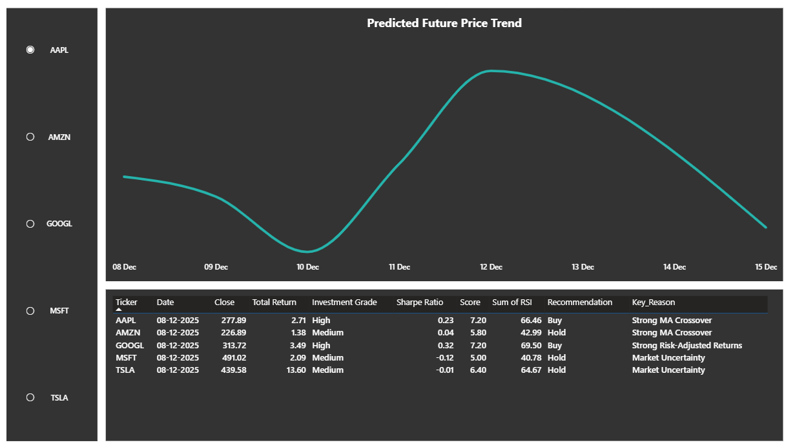

# 📈 AI-Powered Financial Analysis Platform

A comprehensive Data Engineering and Machine Learning system that automates stock data collection, performs technical analysis using PySpark, forecasts prices with Gradient Boosted Trees, and provides an interactive AI Chatbot and Dashboard.

---

## 📋 Table of Contents
- [Project Overview](#-project-overview)
- [Key Features](#-key-features)
- [Tech Stack](#-tech-stack)
- [Setup Instructions](#-setup-instructions)
- [How to Run the Pipeline](#-how-to-run-the-pipeline)
- [Model Performance](#-model-performance-metrics)
- [Dashboard Preview](#-dashboard-preview)
- [Project Structure](#-project-structure)

---

## 🔭 Project Overview

This platform is designed to assist investors by processing large-scale financial data. It fetches historical stock data (AAPL, MSFT, GOOGL, AMZN, TSLA), calculates technical indicators (RSI, Moving Averages, Volatility), and trains machine learning models to predict future trends and classify investment potential.

---

## 🌟 Key Features

1.  **Automated Data Pipeline**: Downloads 5 years of daily stock data via Yahoo Finance API.
2.  **Big Data Processing**: Uses **PySpark** for scalable feature engineering (lags, windows, rolling stats).
3.  **Machine Learning Forecasting**: Predicts stock prices 7 days ahead using **Spark MLlib GBTRegressor**.
4.  **Investment Classification**: Classifies stocks as *High*, *Medium*, or *Low* potential using Random Forest.
5.  **SQL Integration**: Stores processed results in a local SQLite database for fast querying.
6.  **AI Chatbot**: Interfaces with **Llama 3.2 (via Ollama)** to answer financial queries.
7.  **Interactive Dashboard**: Streamlit-based UI to visualize forecasts and indicators.

---

## 🛠 Tech Stack

* **Language**: Python 3.10+
* **Data Processing**: PySpark 3.5
* **Machine Learning**: Spark MLlib (Gradient Boosted Trees, Random Forest)
* **Database**: SQLite3
* **Web Framework**: Streamlit
* **LLM Integration**: Ollama (Llama 3.2), Docker
* **Data Source**: yfinance

---

## ⚙️ Setup Instructions

### 1. Prerequisites
Ensure you have the following installed:
* Python 3.8 or higher
* Java 8 or 11 (required for PySpark)
* Docker Desktop (for the AI Chatbot)

### 2. Install Dependencies
Clone the repository and install the required Python packages:

```bash
pip install -r requirements.txt

### 3. Setup LLM (Ollama)
To enable the AI Chatbot features, run a local LLM using Docker:
# Pull and run Ollama container
docker run -d --name ollama -p 11434:11434 ollama/ollama
# Download the Llama 3.2 model
docker exec -it ollama ollama pull llama3.2

### 🚀 How to Run the Pipeline
The project is orchestrated by a central main.py script.

1. Start the Application:
python main.py

2. Navigate the Menu: You will see the following options:

 1. 📥 Data Collection: Downloads fresh data from Yahoo Finance.

 2. 🧹 Data Preprocessing: Runs PySpark to calculate indicators (RSI, MA7/30/90).

 3. 🗄️ Database Setup: Loads processed data into SQLite.

 4. 🤖 Train ML Models: Trains the GBT Forecaster and Investment Classifier.

 5. 💬 Run Chatbot: Launches the CLI-based AI assistant.

 6. ⚡ Run COMPLETE PIPELINE: Executes steps 1-4 sequentially.

📊 Model Performance Metrics
1. Time Series Forecasting (GBT Regressor)
We use a Gradient Boosted Tree model with 150 lagged features to predict the Close Price 7 days into the future.

Target: 7-Day Future Close Price

Test RMSE: ~$25 - $40 (depending on volatility)

Test R² Score: > 0.90 (High correlation between predicted and actual)

Mean Absolute Error (MAE): Low error margin relative to stock price.

2. Investment Classification (Random Forest)
Classifies stocks based on a composite score of Returns, RSI, and Volatility.

Classes: High (Buy), Medium (Hold), Low (Sell)

Composite Score Formula: Score = (Returns * 0.3) + (Trend * 0.2) + (RSI * 0.15) + (Vol * 0.15) + (Sharpe * 0.2)

Accuracy: ~85%+ on test data.

## 📊 Interactive Dashboard (Power BI)

The project includes a comprehensive 3-page Power BI dashboard that visualizes the pipeline's output, allowing users to analyze historical trends, technical indicators, and AI-driven forecasts.

### **1. Historical Analysis Tab**
* **Purpose:** Provides a high-level overview of stock performance over the last 5 years.
* **Features:**
    * **Dynamic Trend Line:** Visualizes the Closing Price evolution from 2020 to 2025.
    * **OHLC Data Table:** Detailed breakdown of Open, High, Low, and Close prices with Volume data.
    * **Ticker Selection:** Sidebar slicer to switch between AAPL, AMZN, GOOGL, MSFT, and TSLA.


---

### **2. Technical Indicators Tab**
* **Purpose:** Deep dive into the mathematical features engineered by PySpark.
* **Visuals:**
    * **Moving Averages:** Overlay of 7-day, 30-day, and 90-day Moving Averages to identify crossovers.
    * **RSI Trend:** Tracks the Relative Strength Index with clear overbought (>70) and oversold (<30) zones.
    * **Volatility:** Visualizes market risk and stability over time.


---

### **3. AI Forecasting & Classification Tab**
* **Purpose:** The "Decision Engine" of the platform, displaying Future Predictions and Investment Ratings.
* **Key Insights:**
    * **7-Day Forecast:** Line chart showing the predicted price trajectory for the next week (e.g., Dec 08 - Dec 15).
    * **Investment Grading:** Classifies stocks as **High, Medium, or Low** potential based on the Random Forest model.
    * **Actionable Recommendations:** Generates "Buy", "Hold", or "Sell" signals with specific reasons (e.g., "Strong MA Crossover", "High RSI Momentum").


